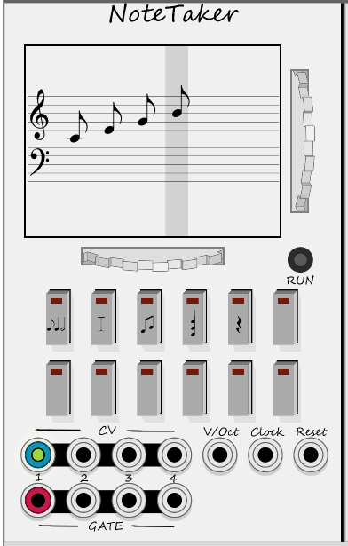
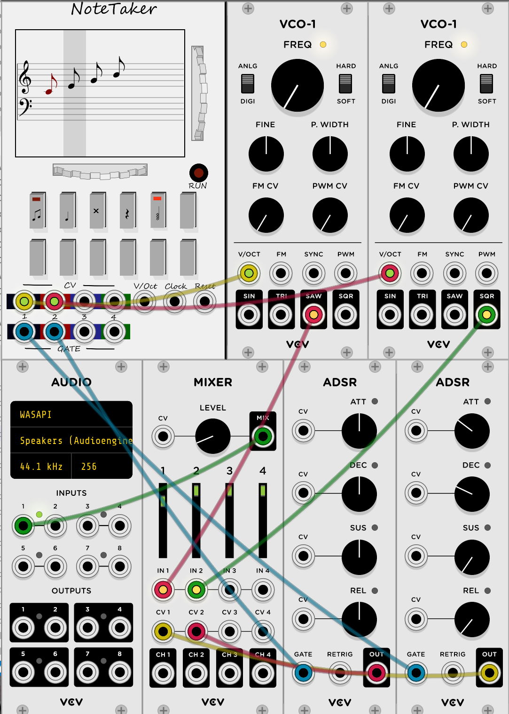

# SchmickleWorks
VCV Rack Modules

Early work on a VCV Rack module to create sequences using traditional music notation.
Sequences are to be saved as MIDI; load and save aren't implemented.
Tested on Windows 10 and occasionally on Mac.

 

Multiple parts see first light.

 
