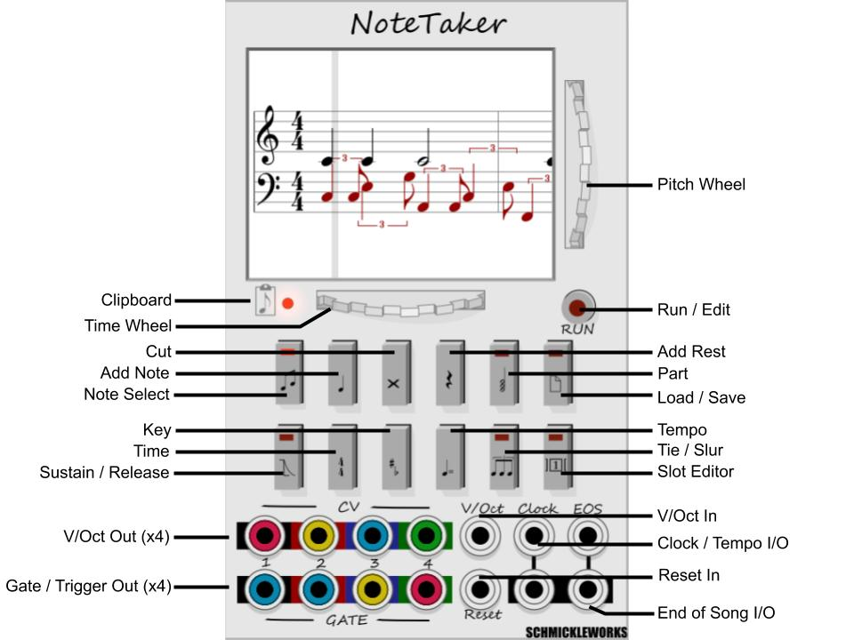

# SchmickleWorks NoteTaker

NoteTaker is a [VCV Rack 0.6](https://vcvrack.com/) module to create sequences
using traditional music notation.

NoteTaker is under active development; the file format, panel layout, and feature
set may change.

NoteTaker is developed and tested on Windows 10 and occasionally on Mac.

 

Planned feature set:

* Sequences are loaded as MIDI formats one and zero, and saved as MIDI format zero.
* State is autosaved between sessions.
* Sequences use from one to four channels.
* Editor supports copy and paste.
* Gate output can be customized to match desired envelope triggering.
* Pitch and tempo can be modified at runtime.
* Score may contain key signature, time signature, and tempo.
* Note pitch varies from MIDI note 0 to MIDI note 127, over ten octaves.
* Note duration varies from 128th notes to octuple whole note.
* CV input modifies pitch, tempo, and reset.
* CV output includes quarter note clock and end of song.

Additional features under consideration include: slurs, triplets,
arpeggios, and trills.

# Import MIDI

Existing MIDI files may be imported for NoteTaker to display and play.
Only files generated by 
[Google's Bach Doodle](https://www.google.com/doodles/celebrating-johann-sebastian-bach)
have been tested.

* Copy the MIDI file to midi/#.mid, where '#' is a small number.
* Press 'File' (far right top row).
* Scroll the horizontal wheel to the added file.
* Move the vertical wheel to 'load'.
* Press 'RUN'.

# Insert Notes with a MIDI device

One part at a time may be entered with a MIDI-capable keyboard.

* Connect Fundamental MIDI-1 CV output to NoteTaker V/Oct input.
* Connect Fundamental MIDI-1 GATE output to NoteTaker Clock input.
* Press 'Select' (far left top row) until LED is red.
* Press a key on the MIDI device to add a quarter note.

The horizontal wheel may be used to change the note duration and the vertical
wheel may be used to change the pitch after the note is entered.

A bug may prevent the first note from appearing.

Press middle C on the MIDI device before pressing 'RUN' to avoid adding an
offset to the playback.

Press 'Part' (second from right top row) to select the channel to add notes.

