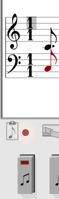
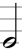
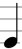
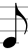
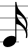
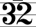
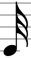
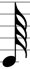
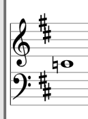
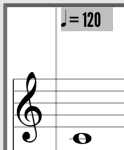

# SchmickleWorks NoteTaker

NoteTaker is a [VCV Rack 1.0](https://vcvrack.com/) module to create sequences
using traditional music notation.

NoteTaker is under active development; the file format, panel layout, and feature
set may change.

NoteTaker is developed and tested on Windows 10 and occasionally on Mac.

 

Planned feature set:

* Sequences are loaded as MIDI formats one and zero, and saved as MIDI format zero.
* State is autosaved between sessions.
* Sequences use from one to four channels (eight with expansion)
* Editor supports copy and paste.
* Gate output can be customized to match desired envelope triggering.
* Pitch and tempo can be modified at runtime.
* Score may contain key signature, time signature, and tempo.
* Note pitch varies from MIDI note 0 to MIDI note 127, over ten octaves.
* Note duration varies from 128th notes to octuple whole note.
* Note duration may include triplets, ties, and slurs.
* CV input modifies pitch, tempo; triggers reset; advances song.
* CV output includes quarter note clock and end of song.

# Editor Buttons

Enable "Parameter tooltips" in the View Menu for a reminder of the buttons' functions.

## Note Select

Note Select has three states: edit, insert, and select. 
Pressing Note Select toggles the three states.

When the LED is off  the wheels edit
the current selection. The horizontal wheel changes the note duration; the vertical wheel changes
the pitch.

When the LED is red  the wheels move
the insertion indicator. The horizontal wheel moves the insertion forwards and backwards in time.
The vertical wheel inserts a duplicate note above or below the existing note.

When the LED is blue  the wheels move
the selection indicator. The horizontal wheel extends the selection before or after the insertion
point. The vertical wheel selects a single note from a chord.

## Add Note

Add Note  adds one or more notes after the current selection. Move
the insertion indicator to the left to add notes at the beginning of the score. 

If the clipboard light  is on Add Note duplicates the last selection.
If the clipboard light  if off Add Note duplicates the rightmost
note in the selection. The clipboard light is on only when the Note Select light is red; when Note
Select is set to insert.

After notes are added, Note Select light is off (edit) so that the Horizontal Wheel changes the
duration of all added notes; the Vertical Wheel changes the pitch of all added notes.

## Cut

Cut  removes the current selection and copies the notes to the clipboard.
If Note Select is red (insert), Cut removes the note to the left of the insertion point. If the
Vertical Wheel added a note to a chord, or if it selected a note in a chord, Cut removes that note.

Cut immediately followed by Add Note undoes the Cut.

## Add Rest

Add Rest  adds a rest after the current selection. Move
the insertion indicator to the left to add a rest at the beginning of the score. 

After the rest is added, Note Select light is off (edit) so that the Horizontal Wheel changes the
duration of the rest.

## Part

Part  chooses the musical part or parts to edit. Each part corresponds to
one of the CV / GATE pairs on NoteTaker or an expansion. MIDI channels or tracks are mapped to parts.

The Horizontal Wheel selects each or all parts. A part may be locked to prevent future editing.
The Vertical Wheel locks the selected part, or makes the selected part editable. The part notes
become transparent when locked, and the part icon shows a lock in place of a circle.

When an existing MIDI file is imported, each track or channel with notes is remapped to parts in
ascending order. (MIDI percussion channels 10 and 11 are currently not mapped to a part.) The
original MIDI instrument name and GM instrument are shown with the part.

## File

File  loads and saves notes from one of 12 slots. The Horizontal Wheel
selects the slot to load from or save to. The Vertical Wheel executes the load or save action.

The notes in all slots are autosaved by VCV Rack if enabled, and are loaded and saved with your patch.
All 12 editor buttons are assigned one slot at run time, allowing the user to switch freely during
a performance. The Playback button allows choosing the slot order triggered by the EOS input.

## Sustain / Release

Sustain / Release  maps the note duration to the GATE output.
The Horizontal Wheel selects the duration of the Sustain or Release cycle. The Vertical Wheel selects
whether to edit the maximum Sustain, minimum Sustain, minimum Release, or maximum Release.

Sustain is the duration of the GATE output held high proportional to the note duration. Minimum
Sustain is the shortest time GATE output is held high. Maximum Sustain is the longest time GATE output is held high.

Release is the duration of the GATE output held low proportional to the note duration. Minimum
Release is the shortest time GATE output is held low. Maximum Release is the longest time GATE output is held low.

If NoteTaker GATE output triggers an ADSR, the Minimum Release setting guarantees the duration of
GATE output held low to make room for ADSR release phase. 
Similarly, the Minimum Sustain setting guarantees the duration of GATE output held high to make
room for the attack/decay/sustain phases.

The sum of Minimum Sustain and Minimum Release dictate the shortest duration note that can be
created, but does not affect the duration of existing notes.

Each part has its own Sustain / Release setting.

## Add Time Signature

Add Time Signature  adds a time signature after the current
selection. A time signature counts the number of beats per measure, and the duration of the beat,
for notes going forward.

Adding a time signature starts a new measure, even if the prior measure does not have enough notes
to satisfy its time signature.

When Note Select is off (edit), the Horizontal Wheel changes the Time Signature value. The 
Vertical Wheel chooses the numerator or denominator.

The upper number may be set from one to 99 beats per measure. The lower number may be set to:
-  One whole note  equals one beat.
-  One half note  equals one beat.
-  One quarter note  equals one beat.
-  One eighth note  equals one beat.
-  One sixteenth note  equals one beat.
-  One thirty-second note  equals one beat.
-  One sixty-fourth note  equals one beat.

Adding a time signature is useful when it is desirable to move from one slot to the next
exactly at the end of a measure, or at the end of a beat.

## Add Key Signature

Add Key Signature  adds a key signature after the current
selection. A key signature indicates the number of sharps or flats preset for notes going
forward.

Adding a key signature starts a new measure, even if the prior measure does not have enough notes
to satisfy its time signature.

When Note Select is off (edit), the Vertical Wheel modifies the key by one sharp or one flat at
a time.

Adding a key signature only affects the displayed notes; it has no impact on editing or playback.
Changing key signature does not change the pitch of existing notes; the display adds accidentals
as needed to keep playback the same.

## Add Tempo

Add Tempo  adds a tempo change after the current selection.
A tempo change sets the number of beats per second for the notes going forward.

Adding a tempo change starts a new measure, even if the prior measure does not have enough notes
to satisfy its time signature.

When Note Select is off (edit), the Horizontal Wheel modifies the number of beats per second.
Tempo may be set from three beats / second, up to 5367 beats / second. (No reason for these limits;
subject to change before NoteTaker release.)

to do

## Tie / Slur / Triplet

to do

## Slot Editor

to do

# Import MIDI

Existing MIDI files may be imported for NoteTaker to display and play.

* Create a folder named SchmickleWorks in the Rack folder.
* Copy the MIDI file to import to SchmickleWorks.
* Right-click on NoteTaker.
* Select "Load MIDI".
* Select the MIDI file to load.

# Insert Notes with a MIDI device

One part at a time may be entered with a MIDI-capable keyboard.

* Connect Fundamental MIDI-1 CV output to NoteTaker V/Oct input.
* Connect Fundamental MIDI-1 GATE output to NoteTaker Clock input.
* Press 'Select' (far left top row) until LED is red.
* Press a key on the MIDI device to add a quarter note.

The horizontal wheel may be used to change the note duration and the vertical
wheel may be used to change the pitch after the note is entered.

Press middle C on the MIDI device before pressing 'RUN' to avoid adding an
offset to the playback.

Press 'Part' (second from right top row) to select the channel to add notes.

